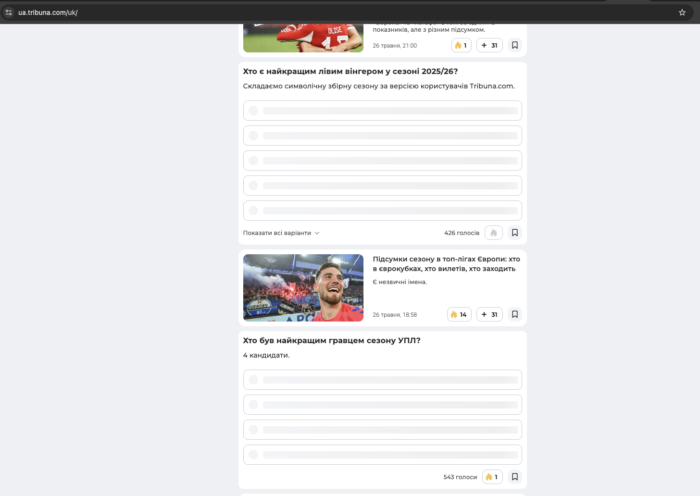
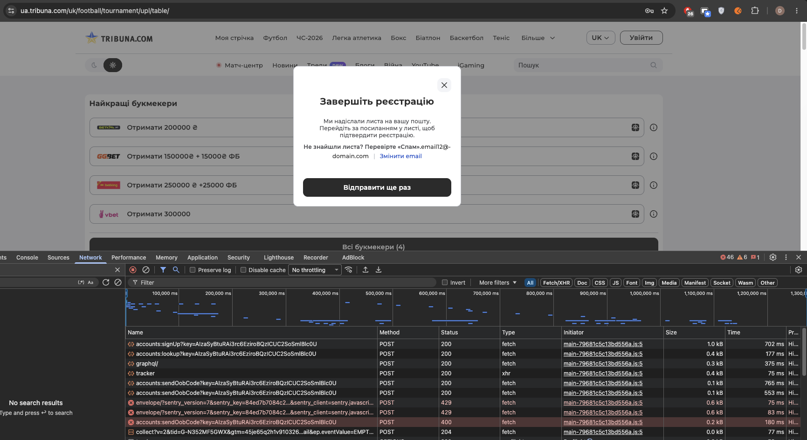
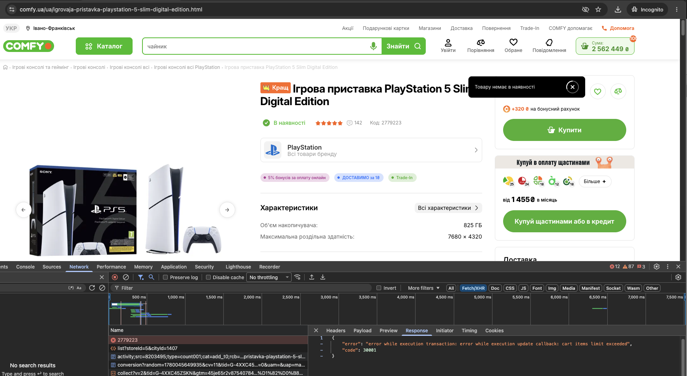
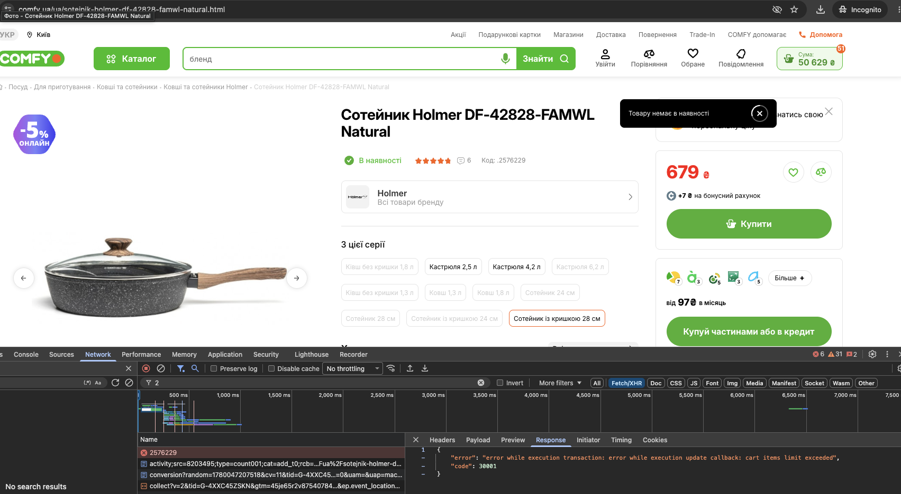
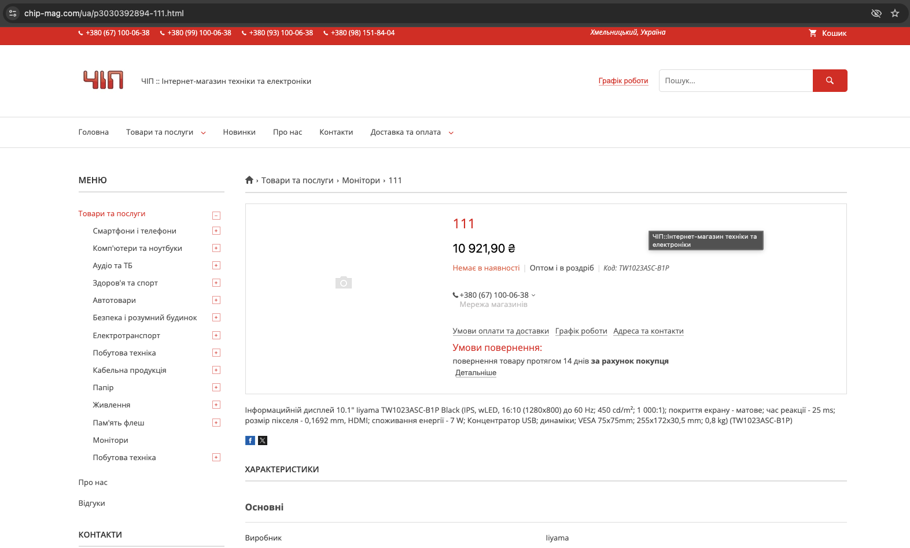
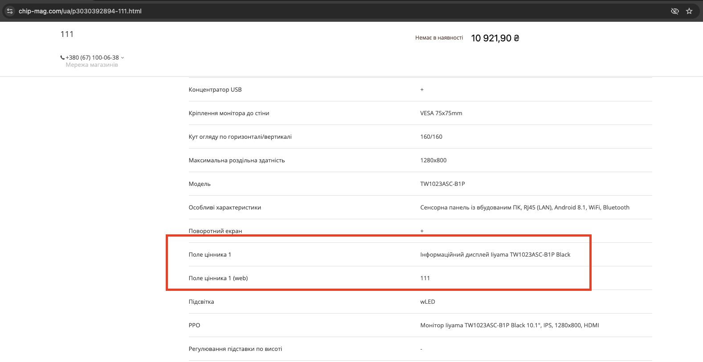
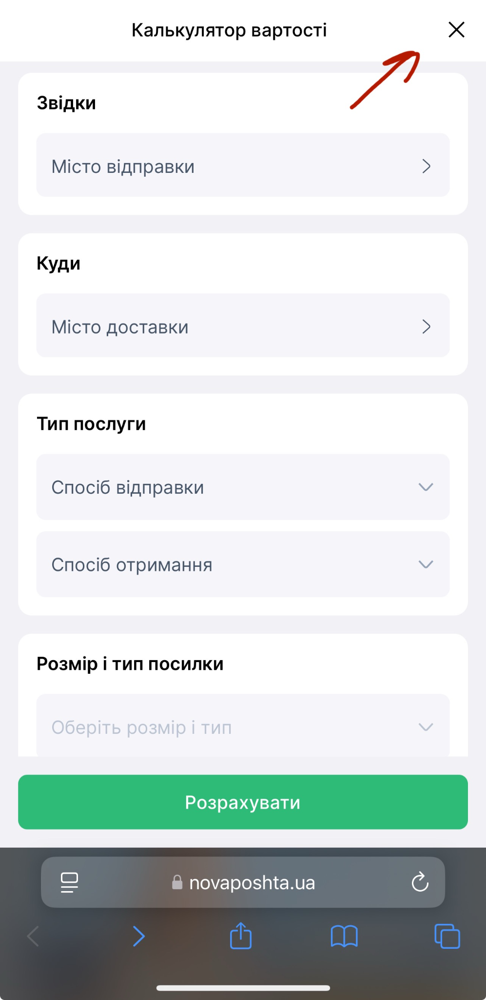
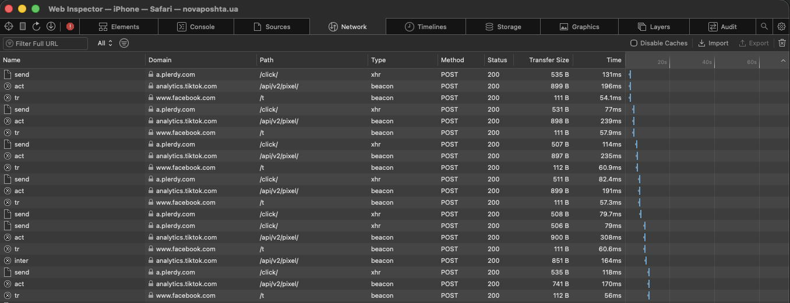

# Bug Reports

Manual testing of live production websites. All bugs were found independently using Chrome DevTools, Safari Web Inspector (real device, USB), and Postman.

| # | Site | Title | Type |
|---|---|---|---|
| 1 | [tribuna.com](#bug-1--tribunacom--poll-widget-rendering-failure) | Poll widget rendering failure after lazy load | API/UI mismatch |
| 2 | [tribuna.com](#bug-2--tribunacom--false-success-message-on-registration-failure) | False success message on registration failure | API/UI mismatch |
| 3 | [comfy.ua](#bug-3--comfyua--false-out-of-stock-message-when-cart-limit-exceeded) | False "Out of stock" when cart limit exceeded | API/UI mismatch |
| 4 | [chip-mag.com](#bug-4--chip-magcom--test-data-published-in-production) | Test product data published in production | Data integrity |
| 5 | [novaposhta.ua](#bug-5--novaposhtaua--calculator-modal-close-button-unresponsive-on-ios) | Calculator modal close button unresponsive on iOS | Mobile/Functional |

---

## Bug 1 · tribuna.com · Poll Widget Rendering Failure

**Environment:** Google Chrome 148.0.7778.179 / iPhone 12 Pro (Chrome DevTools emulation)

**Type:** `API/UI mismatch`

### Pre-conditions
Open `https://ua.tribuna.com/uk/` in incognito window (not logged in, cache and cookies cleared).

### Steps to Reproduce
1. Scroll down the main feed to the bottom until the **"Завантажити ще"** button is visible
2. Click **"Завантажити ще"**
3. Scroll down further and locate the newly loaded Poll (Голосування) widget

### Actual Result
Widget slots appear completely blank and broken — no text, no voting options, just empty container shapes.

### Expected Result
Widget slots appear with data, player icons, and voting options.

### Screenshots


### Notes
In Chrome DevTools, upon clicking "Show more", a single POST request to `.../graphql/` is sent. The server successfully returns **HTTP 200 OK** with a valid JSON response containing full poll data and non-null options. Rendering and data-binding failure occur strictly on the frontend.

> The bug is exclusive to **guest users** — it does not occur when logged in.

<details>
<summary>cURL log</summary>

```bash
curl 'https://api-gateway.ua.tribuna.com/graphql/' \
  -H 'accept: */*' \
  -H 'content-type: application/json' \
  -H 'origin: https://ua.tribuna.com' \
  -H 'x-auth-token;' \
  -H 'x-language: uk' \
  --data-raw '{"operationName":"getContentForMainPage","variables":{"status":["PUBLISHED"],"page":2,"pageSize":15,"languages":["UK"],"lang":"UK","contentTypes":["POLL","BLOGPOST"],"main":true}}'
```

Server returns `HTTP 200 OK` with valid poll data. Frontend fails to render it.
</details>

---

## Bug 2 · tribuna.com · False Success Message on Registration Failure

**Environment:** Google Chrome 148.0.7778.179

**Type:** `API/UI mismatch`

### Pre-conditions
Open `https://ua.tribuna.com/uk/`, not logged in. Clear `email12@-domain.com` from database if existing.

### Steps to Reproduce
1. Press **"Увійти"**
2. In the pop-up choose **"Реєстрація"**
3. Enter an invalid email with a leading hyphen in the domain: `email12@-domain.com`
4. Enter a valid password with 6 symbols (e.g. `123456`)
5. Click **"Зареєструватись"**

### Actual Result
The UI displays a success message **"Завершіть реєстрацію"** (Confirmation sent). However, registration has failed — no email is actually sent.

### Expected Result
Action blocked due to invalid email format. An error message shown to the user.

### Screenshots


### Notes
DevTools Network tab shows **HTTP 400** and **HTTP 429**.

Status 400 preview response:
```json
{ "message": "TOO_MANY_ATTEMPTS_TRY_LATER" }
```

The frontend renders a success state regardless of the server response code.

---

## Bug 3 · comfy.ua · False "Out of Stock" Message When Cart Limit Exceeded

**Environment:** comfy.ua (production)

**Type:** `API/UI mismatch`

### Pre-conditions
Open `https://comfy.ua/`

### Steps to Reproduce
1. Start adding unique items to the cart one by one without increasing their internal quantity
2. Continue adding items until the system boundary limit is reached (typically between 50 and 100 items)

### Actual Result
The UI displays a misleading pop-up: **"Товару немає в наявності"** (Out of stock).
Under the hood, the API request fails with **error 30001: cart items limit exceeded**.

### Expected Result
The system should block adding more items and display a clear, honest warning:
> «У кошик можна додати не більше X товарів»

### Screenshots



### Notes
API response body:
```json
{
  "error": "error while execution transaction: error while execution update callback: cart items limit exceeded",
  "code": 30001
}
```

The frontend handles the exception incorrectly — translating a database/cart limit error into a product availability error.

---

## Bug 4 · chip-mag.com · Test Product Data Published in Production

**Environment:** chip-mag.com (production)

**Type:** `Data integrity`

### Pre-conditions
Open `https://chip-mag.com/`

### Steps to Reproduce
1. Go to the category **"Монітори"**
2. Click on the only available product card named **"111"**
3. Scroll down to **"Характеристики" → "Користувальницькі характеристики"**
4. Analyze the product title, image, and the fields: **"Поле цінника 1"** and **"Поле цінника 1 (web)"**

### Actual Result
The actual product name (`"Інформаційний дисплей Iiyama TW1023ASC-B1P Black"`) is incorrectly mapped to the field **"Поле цінника 1"**, while the test string `"111"` is mapped to **"Поле цінника 1 (web)"**.

### Expected Result
The category contains real, active products with correct commercial titles, actual product photos, and properly mapped specification fields.

### Screenshots



### Notes
This is a clear case of **test data leaking into the production environment**. The system reads the string from the internal "web price tag" field and displays it as the main Product Title on the frontend, while the real product name is buried in the specs.

---

## Bug 5 · novaposhta.ua · Calculator Modal Close Button Unresponsive on iOS

**Environment:** iPhone 13 Pro Max · iOS 18.3 · Safari 18.3 · Safari Web Inspector (real device, USB)

**Type:** `Mobile/Functional`

### Pre-conditions
Open `https://novaposhta.ua/` in Safari on iPhone 13 Pro Max.

### Steps to Reproduce
1. Scroll down to **"Розрахуй вартість свого відправлення"** and open the calculator modal
2. Tap **"Продовжити"**
3. Tap the close button **✕** to dismiss the modal
4. Observe that the modal does not close
5. Continue tapping ✕ — repeat until the modal closes

### Actual Result
The close button receives the tap (visual feedback visible) but the modal does not close. Closing requires **4–5 consecutive taps**. On each unsuccessful tap, a batch of third-party analytics requests fires. The modal closes only after an `inter` event from `analytics.tiktok.com` completes.

### Expected Result
The modal closes immediately on the first tap of ✕, regardless of the state of any third-party analytics requests.

### Screenshots

<br><br>


### Network Log Pattern

| Tap | Requests fired | Result |
|---|---|---|
| Tap 1–4 | `send` (plerdy) → `act` (tiktok) → `tr` (facebook) | ❌ Modal stays open |
| Tap 5 | `send` → `act` → `tr` → **`inter`** (tiktok) | ✅ Modal closes |

### Root Cause Hypothesis
The modal close handler appears to be coupled to a TikTok analytics `inter` event callback. Each tap fires analytics events but the UI action is blocked until the `inter` beacon completes — suggesting a missing `event.stopPropagation()` or an incorrect async dependency in the close button's event listener.

### Notes
- Not reproducible in Chrome desktop (including device emulation — emulator result is different: button completely unresponsive, which may be a separate issue)
- Confirmed on physical device only via Safari Web Inspector (USB debugging)
- Behaviour is consistent and reproducible across multiple test sessions
